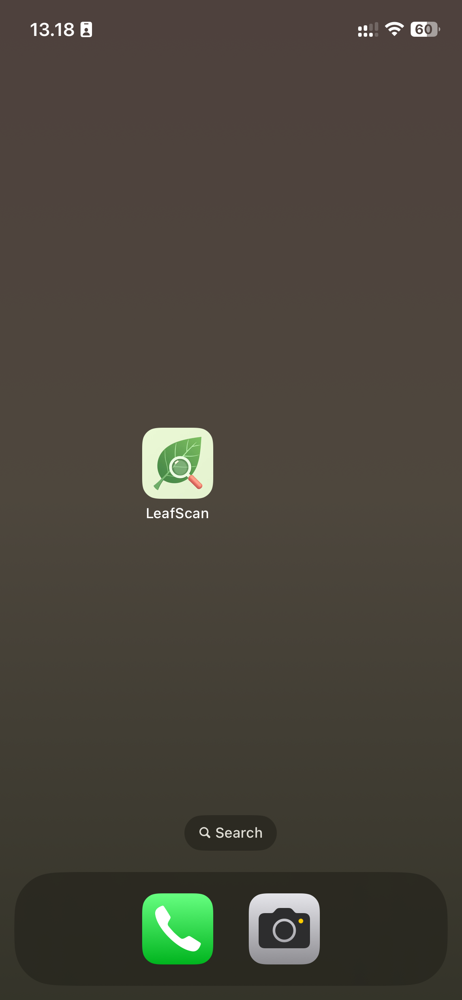

# 🍃 LeafScan - AI Plant Disease Detection

An iOS app that uses machine learning to identify plant diseases from leaf images in real-time.



## 📱 Features

- **Real-time Disease Detection**: Instantly identify plant diseases from photos
- **38 Disease Classes**: Supports detection of 38 different plant diseases across multiple crops
- **High Accuracy**: 94% validation accuracy on 54,000+ images
- **User-Friendly Interface**: Clean SwiftUI design with camera and gallery integration
- **Offline Capable**: All processing happens on-device using Core ML

## 🖼️ Screenshots

  

## 🛠️ Technologies Used

- **Swift & SwiftUI**: Modern iOS development
- **Core ML**: On-device machine learning
- **Vision Framework**: Image analysis and preprocessing
- **Create ML**: Model training and optimization

## 🧠 Model Details

- **Dataset**: PlantVillage (54,305 images across 38 classes)
- **Training Accuracy**: 94.9%
- **Validation Accuracy**: 94.1%
- **Feature Extractor**: Image Feature Print V1
- **Input Size**: 299x299 pixels

## 📦 Dataset

The PlantVillage dataset is too large to include in this repository.

**Download dataset:**
- Source: [PlantVillage on Kaggle](https://www.kaggle.com/datasets/abdallahalidev/plantvillage-dataset)
- Size: ~500MB compressed
- Place in project root after downloading

### Supported Crops & Diseases

Apple, Blueberry, Cherry, Corn, Grape, Orange, Peach, Pepper, Potato, Raspberry, Soybean, Squash, Strawberry, Tomato

Diseases include: Black Rot, Powdery Mildew, Early Blight, Late Blight, Leaf Mold, and many more.

## 📋 Requirements

- iOS 15.0+
- Xcode 14.0+
- Real iOS device (optimized for iPhone, works best on real hardware)

## 🚀 Installation

1. Clone this repository:
```bash
   git clone https://github.com/YOUR_USERNAME/LeafScan-iOS.git
```

2. Open the project:
```bash
   cd LeafScan-iOS
   open LeafScan.xcodeproj
```

3. Run on your iPhone:
   - Connect your iPhone to Mac
   - Select your device in Xcode
   - Press Cmd+R to build and run

**Note**: This app works best on real iOS devices. The iOS Simulator may have compatibility issues with Vision Framework.

## 🎯 How It Works

1. **Image Input**: User selects a leaf image via camera or photo library
2. **Preprocessing**: Vision framework automatically handles image resizing and normalization
3. **Inference**: Core ML model predicts the disease class
4. **Results**: App displays disease name with confidence score

## 🏗️ Project Structure
```
LeafScan/
├── LeafScan/
│   ├── ContentView.swift          # Main UI and classification logic
│   ├── ImagePicker.swift          # Camera/Gallery picker
│   ├── LeafScanApp.swift         # App entry point
│   └── Assets.xcassets/          # Images and app icon
├── LeafScan Model 2.mlmodel      # Trained Core ML model
└── Screenshots/                   # App screenshots
```

## 🔧 Technical Challenges & Solutions

### Challenge 1: Low Accuracy with Manual Preprocessing
**Problem**: Initial implementation with manual pixel buffer conversion produced random predictions despite good training metrics.

**Solution**: Switched to Vision Framework which handles all preprocessing automatically, matching Create ML's internal preprocessing pipeline.

### Challenge 2: "Could Not Create Inference Context" Error
**Problem**: Vision Framework failed on iOS Simulator with cryptic error.

**Solution**: Tested on real iPhone device - Vision Framework works perfectly on actual hardware. Always test ML models on real devices.

## 📊 Performance

- **First Prediction**: ~2-3 seconds (includes model loading)
- **Subsequent Predictions**: Near-instant (<0.5s)
- **Model Size**: 608 KB (highly optimized)
- **Memory Usage**: Minimal (~20MB)

## 🎓 Skills Demonstrated

- Machine Learning model training and optimization
- iOS app development with SwiftUI
- Computer Vision and image processing
- Core ML integration
- Debugging and problem-solving
- User interface design

## 📝 Future Enhancements

- [ ] Add treatment recommendations for detected diseases
- [ ] Support for more crop types
- [ ] Disease history tracking
- [ ] Share results feature
- [ ] Multi-language support

## 👨‍💻 Developer

**Aucky Riman Halim**
- Apple Developer Academy Alumni (2021)
- Applying for Apple Developer Institute for AIML @ UC Surabaya (2026)

## 📄 License

This project is created for educational purposes as part of Apple Developer Institute application portfolio.

## 🙏 Acknowledgments

- **Dataset**: PlantVillage Dataset
- **Apple**: Create ML, Core ML, and Vision Framework
- Built during portfolio preparation for Apple Developer Institute for AIML
